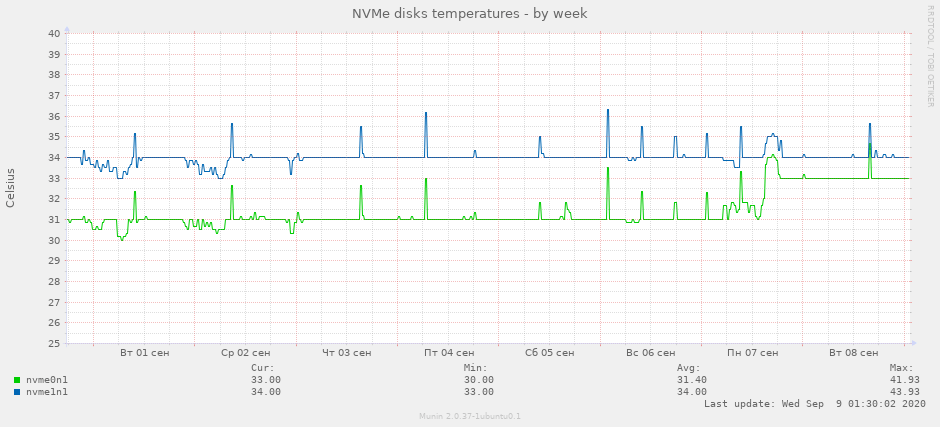

# NVMe plugin for Munin

Simple plugin for displaying useful info about installed nvme drives.



## Requirements
- Python 3.6
- [nvme-cli](https://github.com/linux-nvme/nvme-cli)

## Installation
One-liner: downloads the plugin file directly to the plugins directory and changes the config file:
```
curl -s https://raw.githubusercontent.com/ingria/munin-nvme/master/munin_nvme.py -o /etc/munin/plugins/nvme && chmod +x /etc/munin/plugins/nvme && sed -i '1s/^/[nvme]\nuser root\n\n/' /etc/munin/plugin-conf.d/munin-node
```

### Step-by-step
1. Alternative (and more correct) way is to clone this repo and then link `munin_nvme.py` to munin plugins directory:
```
ln -s /path/to/your/munin_nvme.py /etc/munin/plugins/nvme
chmod +x /etc/munin/plugins/nvme
```

2. Add these lines to `/etc/munin/plugin-conf.d/munin-node`:
```conf
[nvme]
user root
```

3. Test the output: the following shell command should not return errors:
```bash
munin-run nvme
```

3. Restart munin-node. For Ubuntu: `service munin-node restart`.

## License
The MIT License (MIT). Please see [License File](LICENSE) for more information.
